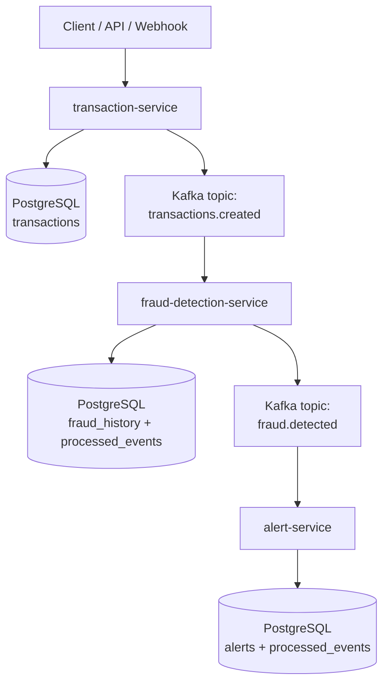

# Event-Driven Fraud Detection

Backend orientado a eventos para registrar transacciones financieras, detectar fraude de forma asíncrona y generar alertas sin bloquear la operación principal.

## Arquitectura



### Servicios

1. **transaction-service** (puerto 8080)
    - Expone API REST y endpoint webhook.
    - Persiste la transacción.
    - Publica evento `TransactionCreated` en Kafka.

2. **fraud-detection-service** (puerto 8081)
    - Consume `TransactionCreated`.
    - Aplica reglas de fraude.
    - Publica `FraudDetected` cuando corresponde.

3. **alert-service** (puerto 8082)
    - Consume `FraudDetected`.
    - Registra alertas en BD.
    - Envía notificaciones vía múltiples canales (Log + Email).

## Resiliencia incluida

- **Idempotencia** en consumidores (`eventId` en tabla `processed_events`).
- **Retries** de consumidor con backoff fijo (1s, 3 intentos).
- **Dead Letter Topic (DLQ)** por tópico principal.
- **Reproceso automático** de eventos desde DLQ.
- **Persistencia local** por servicio para mantener responsabilidades separadas.

## Reglas de fraude incluidas

| Regla | Condición | Score |
|-------|-----------|-------|
| `HIGH_AMOUNT` | monto > $10,000 | +45 |
| `HIGH_VELOCITY` | 5+ transacciones en 1 minuto | +35 |
| `COUNTRY_CHANGE_IN_SHORT_WINDOW` | cambio de país en 30 min | +30 |
| `HIGH_RISK_MERCHANT` | merchant en lista: MRC-999, MRC-666, MRC-404 | +25 |

El score final se calcula por suma de reglas y se limita a 100.

Una transacción se considera fraude cuando `riskScore >= 70` (configurable con `app.fraud.rules.fraud-score-threshold`).

## Topics Kafka

- `transactions.created` (6 particiones)
- `fraud.detected` (6 particiones)
- `transactions.created.dlq`
- `fraud.detected.dlq`

## Stack

- Java 21 / Spring Boot 3.3.2
- Spring Data JPA + Spring Kafka
- PostgreSQL (3 bases de datos dedicadas)
- Docker Compose
- **Observabilidad:** Prometheus + Loki + Promtail + Tempo + Grafana
- **Testing:** JUnit 5 + Testcontainers + RestAssured + Awaitility

## Ejecutar localmente

```bash
docker compose up -d --build
```

Servicios disponibles:

| Servicio | URL |
|----------|-----|
| Transaction Service | http://localhost:8080 |
| Fraud Detection Service | http://localhost:8081 |
| Alert Service | http://localhost:8082 |
| Kafka UI | http://localhost:8089 |
| Prometheus | http://localhost:9090 |
| Loki API | http://localhost:3100 |
| Grafana | http://localhost:3000 (admin/admin) |
| MailHog (emails) | http://localhost:8025 |
| Tempo (traces) | http://localhost:3200 |

## Notificaciones

El `alert-service` envía notificaciones por dos canales:

1. **Log** — siempre activo, escribe en logs del contenedor
2. **Email** — habilitable vía configuración

### Configurar email

Por defecto está deshabilitado. Para activar:

```yaml
# alert-service/src/main/resources/application.yml
app.notification:
  email:
    enabled: true
    from: fraud-alerts@tu-dominio.com
    to:
      - security@tu-dominio.com
```

O vía variables de entorno:

```bash
APP_NOTIFICATION_EMAIL_ENABLED=true
APP_NOTIFICATION_EMAIL_TO=security@tu-dominio.com
```

**MailHog** está incluido en Docker Compose para desarrollo local — captura todos los emails enviados sin necesidad de un servidor SMTP real. Accede a http://localhost:8025 para ver los emails.

Los emails incluyen un template HTML profesional con:
- Color de severidad según risk score (rojo/naranja/amarillo/verde)
- Información de la transacción
- Lista de reglas que dispararon la alerta

## Observabilidad

El proyecto incluye un stack completo de observabilidad:

- **Prometheus** — métricas de microservicios (`/actuator/prometheus`)
- **Loki** — almacenamiento de logs JSON estructurados
- **Promtail** — recolección de logs de contenedores Docker
- **Tempo** — trazas distribuidas (OpenTelemetry)
- **Grafana** — dashboards y visualización

### Dashboards disponibles

1. **Fraud Detection Observability** — throughput HTTP, latencia P95, errores por código HTTP, logs
2. **Fraud Alerting Live** — alertas en tiempo real, score de riesgo promedio, estado de SLO
3. **Fraud Tracing** — trazas distribuidas correlacionadas con logs
4. **Fraud Alert Triage** — investigación de alertas sobre base de datos real (top razones, timeline, tabla detallada)

### Trazas distribuidas

La plataforma propaga `traceId` y `spanId` a través de:
- Requests HTTP (OpenTelemetry bridge)
- Mensajes Kafka (`observation-enabled`)
- Logs JSON estructurados

Puedes inspeccionar la traza completa de una transacción desde `transaction-service` -> `fraud-detection-service` -> `alert-service` en Grafana > Explore > Tempo.

### Métricas de Prometheus

Métricas de negocio:

- `fraud_alerts_total` — total de alertas creadas
- `fraud_alert_risk_score_count` — cantidad de alertas para distribución de riesgo
- `transactions_received_total` — transacciones entrantes por canal
- `fraud_decisions_total{decision}` — decisiones clean/fraud
- `fraud_alert_notifications_total{channel,outcome}` — resultado de notificaciones por canal
- `kafka_dlq_events_received_total` — eventos DLQ recibidos
- `kafka_dlq_events_reprocessed_total` — eventos DLQ reprocesados con éxito
- `kafka_dlq_events_failed_total` — eventos DLQ con fallo de reproceso

### Alertas SLO de negocio

`observability/prometheus/alerts.yml` incluye reglas SLO orientadas a negocio:

- `FraudPipelineCoverageSLOViolation` — menos del 95% de transacciones llega a una decisión de fraude.
- `FraudToAlertConversionSLOViolation` — menos del 98% de decisiones `fraud` se convierte en alerta.
- `NotificationFailureRateHigh` — ratio de fallo de notificaciones por encima del 5%.
- `FraudEvaluationLatencyHigh` — latencia media de evaluación de fraude > 250ms.
- `AlertNotificationLatencyHigh` — latencia media de notificación > 1.5s.

Tip: filtra por `application` en Grafana para comparar servicios lado a lado.

### Logs JSON estructurados

Todos los servicios emiten logs en formato JSON estructurado:

```json
{
  "timestamp": "2026-02-28T15:30:45.123Z",
  "level": "INFO",
  "logger_name": "com.fraud.transaction.service.TransactionService",
  "message": "Transaction created: txn-abc123",
  "traceId": "a1b2c3d4e5f6789012345678",
  "spanId": "1234567890abcdef"
}
```

Esto permite:
- Filtrado eficiente en Loki por labels (`service`) y fields (`level`, `traceId`)
- Correlación logs <-> trazas en Grafana
- Consultas avanzadas con LogQL

#### Contrato operativo de logging (v1)

Cada transición relevante de estado emite campos `event` y `outcome` para facilitar filtrado y alertas:

- `transaction-service`: `transaction_received`, `transaction_persisted`, `transaction_event_published`, `transaction_event_publish_failed`
- `fraud-detection-service`: `fraud_event_consumed`, `fraud_rules_evaluated`, `fraud_rule_hit`, `fraud_decision_made`, `fraud_event_published`
- `alert-service`: `alert_event_consumed`, `alert_created`, `notification_attempt`, `notification_result`, `fraud_alert_logged`

Campos comunes recomendados:

- `traceId`, `spanId`, `transactionId`, `eventId`
- `duration_ms`, `risk_score`, `error_code`, `error_class`

Consultas LogQL útiles:

```logql
{service="fraud-detection-service"} | json | event="fraud_decision_made" | decision="fraud" | risk_score >= 80
```

```logql
{service=~"transaction-service|fraud-detection-service"} | json | event=~".*publish_failed"
```

```logql
{service="alert-service"} | json | event="notification_result" | channel="email" | outcome="failed"
```

Para desarrollo local con logs legibles:

```bash
SPRING_PROFILES_ACTIVE=dev mvn spring-boot:run -pl transaction-service
```

## API

### Crear transacción (REST)

```bash
POST http://localhost:8080/api/v1/transactions
```

```json
{
  "userId": "user-123",
  "amount": 15000,
  "currency": "USD",
  "merchantId": "MRC-999",
  "country": "US",
  "paymentMethod": "CARD"
}
```

### Crear transacción (webhook)

```bash
POST http://localhost:8080/api/v1/webhooks/transactions
```

Mismo payload que REST.

### Consultar alertas

```bash
GET http://localhost:8082/api/v1/alerts
GET http://localhost:8082/api/v1/alerts/users/{userId}
```

## Scripts de prueba

```bash
# Escenario único de fraude y verificación de alertas
bash scripts/single-fraud-scenario.sh

# Stress test con k6 (modo interactivo si hay TTY)
bash scripts/run-k6-stress.sh

# Prueba determinística de ambas DLQ (fraud + alert)
bash scripts/test-dlq.sh

# Stress test no interactivo con parámetros
STRESS_RPS=900 STRESS_DURATION=3m PREALLOCATED_VUS=400 MAX_VUS=3000 \
  bash scripts/run-k6-stress.sh --non-interactive

# Ejemplo agresivo con k6
STRESS_RPS=5500 STRESS_DURATION=2m PREALLOCATED_VUS=1500 MAX_VUS=8000 bash scripts/run-k6-stress.sh
```

## Tests

### Tests unitarios e integración

```bash
# Todos los servicios
mvn test

# Un servicio específico
mvn test -pl alert-service
```

Incluye:
- Tests de reglas de fraude (`fraud-detection-service`)
- Tests de procesamiento de alertas (`alert-service`)
- Tests de controladores REST
- Tests de integración con Testcontainers (Kafka + PostgreSQL)

### Tests End-to-End

El proyecto incluye un módulo de tests E2E que verifica el flujo completo:

```bash
mvn verify -pl e2e-tests
```

**Nota:** Requiere Docker ejecutándose. Levanta los 3 servicios + Kafka + PostgreSQL vía Testcontainers y ejecuta 5 escenarios:
1. Transacción fraudulenta genera alerta
2. Transacción normal NO genera alerta
3. Webhook endpoint funciona E2E
4. Múltiples reglas acumulan risk score
5. Validación de input rechaza requests inválidos

También incluye un escenario de carga mixta (`mixedLoad_shouldKeepApiHealthyAndGenerateExpectedAlerts`) que:

- envía 120 requests concurrentes (REST + webhook)
- valida error rate <= 2% y P95 < 2.5s en `transaction-service`
- verifica que el volumen esperado de alertas de fraude se materializa en `alert-service`

## Desarrollo local sin Docker

```bash
# Requiere Kafka y PostgreSQL funcionando
mvn -pl transaction-service spring-boot:run
mvn -pl fraud-detection-service spring-boot:run
mvn -pl alert-service spring-boot:run
```

Con perfil dev para logs legibles:

```bash
SPRING_PROFILES_ACTIVE=dev mvn -pl transaction-service spring-boot:run
```

## Troubleshooting

- **Kafka no responde:** verifica que esté en estado `healthy` en Docker Compose
- **No ves alertas:** espera ~5-10 segundos (tiempo de procesamiento Kafka) y revisa logs
- **Tests de integración fallan:** confirma que Docker tiene memoria suficiente
- **Email no llega:** revisa MailHog en http://localhost:8025
- **Traces no aparecen:** verifica que Tempo esté healthy y `MANAGEMENT_OTLP_TRACING_ENDPOINT` apunte a `http://tempo:4318/v1/traces`
- **Logs faltantes en Loki bajo carga:** reinicia `loki` y `promtail` tras cambios de configuración (`docker compose up -d --force-recreate loki promtail`) para aplicar límites de ingesta y persistencia de offsets de Promtail.
